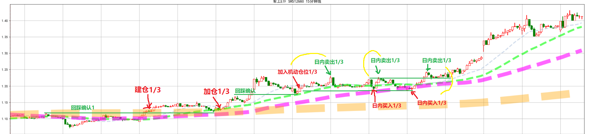
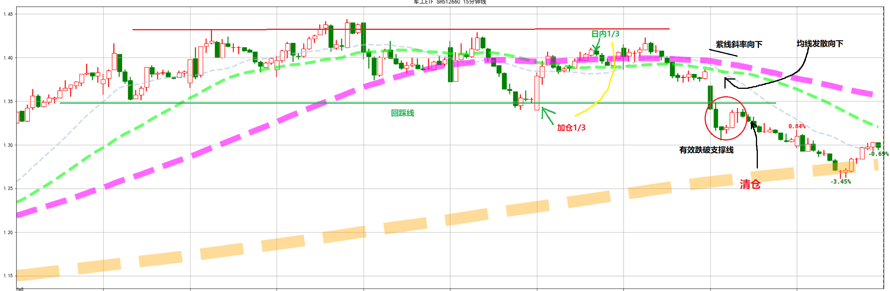
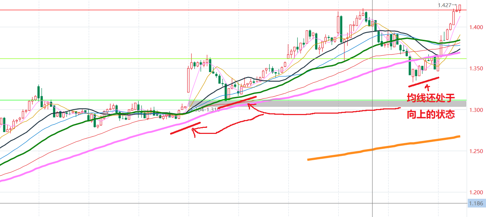
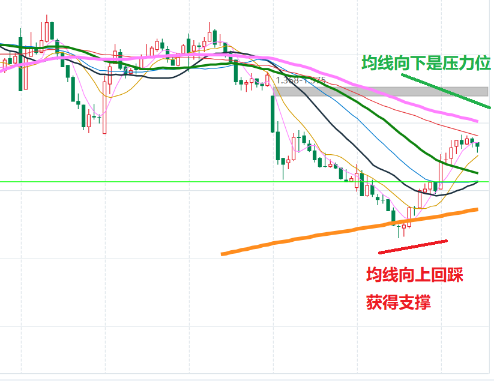

### 交易规则
- **白线**：5分钟60均线相当于15分钟级别布林中线。
- **绿线**：5分钟120均线相当于30分钟级别布林中线。
- **紫线**：5分钟240均线相当于60分钟级别布林中线、日线的5日均线。 
- **橙线**：5分钟960均线、日线的20日均线 
- 只做市场中较热的主线，最多3只
- 每只最多分配30%的总资金。
- 并且做淘汰换股。换股在清仓完成后用规则在不同品种上建仓。
- 基本原则是顺大势逆小势，在判断出大势向上后，在小势逆的情况下加仓。
- 紫线必须水平或者向上同时橙线必须平或向上。
- 持仓区间大概在白线和绿线金叉与死叉区间
- 建仓时最好选择大盘气氛较好的点开始。
- 在建仓结束后使用1/3仓位反复做T  (该操作可选，市场氛围好就不要做)

**将均线换成白线5日、绿线10日、紫线20日、橙线60日可以的到大级别的交易系统。**

### 建仓
- 市场热点,行业排行出现在前5里面
- 初期介入的白线和绿线已经金叉。
   中途介入的股价回踩绿线或者紫线后反弹，最好伴有5分钟中枢上行。
- 5分钟均线多头发散向上。
- 股价必须有效站上紫线，发生过回踩紫线确认或者沿着60分钟向上打开。
- 行业有特大资金流入。

**在确定条件成立果断买入1/3仓位，第一次加仓点再次增加1/3仓位，当再次进入加仓点就是滚动资金。
2/3一直持有到趋势结束，1/3仓位进行反复做T。**

技巧是寻找支撑位置买入，在高点有利润就卖出，确保成功率。
在趋势没坏的情况下如果操作失误或者情况好于预期可以持有到第二天。

### 清仓
- 白线和绿线死叉排除均线缠绕情况。
- 有效跌穿紫线、反弹高度不过紫线，单次对称跌穿或多次跌穿。
- 紫线附近均线缠绕后出现向下发散，或者紫线附近存在5分钟中枢下行。
- 紫线斜率向下（必须马上行动）。
- 有效跌穿支撑线（必须马上行动）。
清仓完成后要想重新建仓必须完全满足建仓条件。

### 有以下条件趋势更加肯定
- 紫线和更大级别的20日或者60日均线进行过粘合
- 多条均线缠绕（布林通道）持续的时间越久均线的级别越大当通道打开后的趋势越是肯定。
- 多次回踩一个低点股价不破，股价出现回踩均线上行的情况，股价低点跨度越大上行的趋势越是肯定。
	这一条是拆开的第一条，取其下半部分，舍弃了均线缠绕或者布林通道，股价形态没有明显的通道特征。
	相反的另一部分规律是
  股价多次冲到一个高点不破，然后出现顶均线下行的情况。
- 每次股价突破一次或多次回踩上突破前的最高点不破，突破更加肯定。

### 补充
如果股价下跌中间没有经过中枢就发生连续的下跌多半还有回归可能，因此保持耐心等待反弹。
特别是在还有仓位没有处理的情况下要保持一定的定力。

特大资金:
- 正常规律：多日不回头流出，股价下跌，第一个流入日可以开始建仓，随后特大资金震荡，股价也区间震荡，都可以逢低买入。  
- 补充规律：股价在上升过程过程中，出现当日不回头流出，但是股价并没有下跌多少，还有可能在再次流入。
- 总之在市场较强时，特大资金在流出后股价下跌幅度较小或者反升都会刺激特大资金再次流入，并且预示较大的行情酝酿中。

**紫线跌破如果橙线向上，短期紫线如果还保持斜率向上。多半是因为大盘带动导致的短期杀跌，当大盘企稳反弹的机会较大**

**同上当跌破的均线斜率向上，如果大盘企稳有望获得支撑，但是向上触及斜率向下的均线多会形成压力**

#### 2021-2-2
一波行情演进过程是先强势品种大幅拉升，然后高位震荡，高位震荡过程中强势品种都下跌的周期低位品种补涨。
下跌的开始是这一波的强势股最弱的先行下跌。
大跌之后抓反弹找那些形态保持较好的市场逻辑的主线，一般跌幅靠前形态破位的反弹也会比较弱。
比如当前行情的新能源，酒，医药，而跌幅较大形态破位的的军工，证券反弹较弱。

#### 2021-2-6
在上涨过程中的股票早盘都有获利了结的情况，就是9:30-10:00的下跌阶段然后市场继续上涨。
在下跌过程中的股票早盘多比较强势，随后多继续下跌。

#### 2021-2-9
***感悟：***市场从超跌，随后企稳缓和有大资金抄底，中间震荡上行，到过量上涨，出现大资金跑路震荡下行。
    市场的变化不会是线性进行，仔细感觉市场的趋势。平缓的采取措施。
    在一波超跌到大资金抄底，要将仓位加起来。在上行出现转折时逐步将仓位降下来。
    而不要反过来操作，不要等到涨的很高了，才开始增加仓位。在加仓时优先选择弹性较好的品种。前期没有大幅杀跌破位的情况。
    不要预测顶部和底部，只有当出现顶部大资金跑路，或者底部大资金抄底再做出决断。  
    ***当发现市场转折向上时要适当的追涨（等待只能错失机会），当市场转折向下时要适当的杀跌（等待将会使得损失增加）。***  
    ***只要出现大资金抢筹式流入什么时候开加仓都不晚***  
    ***选择品种还是以在60日均线上的品种为主***  
    ***股价在日线boll通道中线附近及以下出现大资金抢筹一定要加仓***
    
    
### 2021-3-11
***市场气氛弱转强，开盘有跳空向上的缺口优选加仓此类股票。同理市场气氛强转弱，开盘跳空低开的票是要优选抛弃的***

### 2021-3-13
***只在早盘10点半前如果大盘上涨特大资金流入，考虑加入满仓状态。持续到某天收盘为绿或者大资金kdj下行这时要大幅度调低仓位***
- 日线处在boll通道底部，前面有空方充分释放或者在底部横盘1周以上。
- 在日线boll上轨小幅震荡，某日早盘启动可能有突破行情。
- 启动周期看特大资金kdj指标都已经贴0轴粘合。
- 启动多发生在日线macd将要翻红附近
- 选择方面以先启动的板块和主启动日的领涨板块为主
***如果昨日是大资金首流入行情次日情况应对***
1. 不能发生连续流入大幅杀跌可能性较大（空仓规避为主）
2. 如果连续净流入那是大行情（要满仓）
3. 如果小幅震荡（降低仓位）